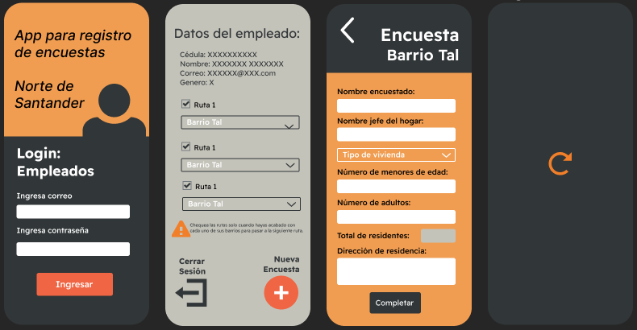

# EncuestApp
Mobile application for survey registration by assigning routes to certain employees. Each route has 5 neighborhoods and an employee must record data from the residents of each neighborhood. Employees and routes assigned manually before.
This application was made as a university final project in 1 week of working: 4 functional views, including Login, route control and registration.
The app utilizes a MySQL database on the free hosting service 000webhosting, which is managed through phpMyAdmin.
CRUD functionality is split across multiple PHP files to handle queries and inserts to the database, which are stored in the file manager of the same hosting service.

Design in Figma: https://www.figma.com/file/bRJ0yCf2MMKbR48KHzcgRm/AppEncuestas?node-id=0%3A1&t=8sws2rPMQwPQ7x4f-1  
Color Palette: https://coolors.co/f06543-e7e7e7-c4c3ba-313638-f09d51  
App Icon/Logo:   
App Views: 
